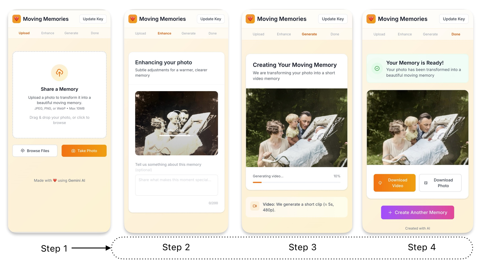
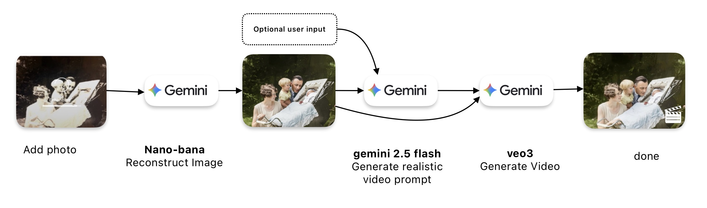

# Moving Memories

Turn a single photo into a tiny living memory. Upload or take a photo—then it's one click. We enhance what's there, imagine a gentle 5‑second motion that fits the moment, and render a short clip. Prompt templates + AI adapt to the actual image content, optionally guided by a note you add.



## ✨ What it does
- Enhance your photo and extract a concise caption with **Gemini 2.5 Flash Image Preview**
- Stream a natural “motion description” with **Gemini 2.5 Flash**
- Generate a 5‑second video with **VEO 3 Preview**

Everything runs in the browser with your own API key. Your media stays on your device.

## 🚀 Live Demo
- **Live Demo**: https://serjoschduering.github.io/MovingMemories_simple/

## 🧰 Quickstart
Prereqs: Node.js 18+

```bash
npm install
npm run dev
```

Open the app, click “Setup” in the header, and paste your Google AI API key.

Alternatively, you can set it from the browser console:

```js
setApiKey('AIza...') // stored in localStorage
```

Build for production:

```bash
npm run build
npm run preview
```

## 🧠 How it works (pipeline)
1) Upload photo → lightweight client‑side resize
2) Enhance + caption with **Gemini 2.5 Flash Image Preview**
3) Stream a motion description with **Gemini 2.5 Flash** (fast, responsive UX)
4) Generate a short clip with **VEO 3 Preview**
5) Download and share



## 💡 Tips
- Add a short note to guide the motion (optional)
- JPEG/PNG/WebP up to 10MB
- Works well with portraits, landscapes, family shots, and events

## 🔒 Privacy
- No backend/server—your key is provided by you and stored locally (browser `localStorage`).
- Images and videos are processed client‑side.

## 🛠️ Tech
- React, Vite, TypeScript, Tailwind CSS, Zustand
- Google AI: **Gemini 2.5 Flash Image Preview**, **Gemini 2.5 Flash (streaming)**, **VEO 3 Preview**

## ❓ Troubleshooting
- Key must be valid and look like `AIza...`
- If you hit quota or see API errors, check your Google AI usage/limits

## License
MIT (or your preferred license)
